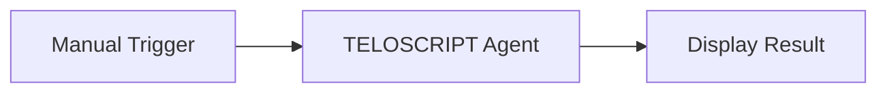

# 🎯 TELOSCRIPT
**Purposeful Agent Orchestration System**

> *"He who has a why to live can bear almost any how." - Friedrich Nietzsche*

TELOSCRIPT is a sophisticated agent orchestration platform that coordinates  MCP (Model Context Protocol) servers toward any goal you can think of. Unlike chat-based MCP implementations, TELOSCRIPT empowers fully autonomous goal resolution by seamlessly orchestrating your provided MCP servers into a purposeful, coordinated system.

## 🎬 Demo Video

[](https://youtu.be/4LPrMRU65bo)

## 🚀 Quick Start

### Prerequisites
- Python 3.12+
- Docker & Docker Compose
- Node.js 18+ (for MCP servers)

### Installation

1. **Clone the repository**
```bash
git clone https://github.com/calumjs/teloscript
cd teloscript
```

2. **Install dependencies**
```bash
pip install -r requirements.txt
```

3. **Start the system**
```bash
# Development mode
python main.py

# Production with Docker
docker-compose up -d
```

4. **Access the orchestration interface**
- Primary Interface: http://localhost:8000/dashboard/test
- API Documentation: http://localhost:8000/docs
- Health Check: http://localhost:8000/health

The web interface provides real-time agent monitoring, configuration management, and an intuitive way to launch agents with visual feedback.

## 🔌 Running as MCP Server

TELOSCRIPT can also run as an MCP (Model Context Protocol) server, allowing other MCP clients (like Claude Desktop, Continue, or other AI tools) to access TELOSCRIPT's agent orchestration capabilities.

### Method 1: uvx (Recommended for Quick Testing)

**Pros:**
- ✅ **Instant setup** - No local installation required
- ✅ **Isolated environment** - No conflicts with system packages
- ✅ **Always latest** - Pulls from GitHub automatically
- ✅ **Zero maintenance** - uvx handles dependencies

**Cons:**
- ❌ **Default configs only** - Can't access custom `config/mcp_configs.json`
- ❌ **Limited customization** - Uses built-in MCP server configurations
- ❌ **Network required** - Downloads package each time

```bash
# Run directly with uvx (no installation needed)
uvx --from git+https://github.com/calumjs/teloscript.git teloscript-mcp
```

### Method 2: Local Development (Recommended for Custom Configs)

**Pros:**
- ✅ **Full customization** - Access to your `config/mcp_configs.json` and `config/purpose_endpoints.json`
- ✅ **Custom MCP servers** - Use your configured Brave Search keys, GitHub tokens, etc.
- ✅ **Development workflow** - Make changes and test immediately
- ✅ **Offline capable** - Works without internet after installation

**Cons:**
- ❌ **Setup required** - Need to install dependencies locally
- ❌ **Environment management** - Need to maintain Python environment

```bash
# Clone and install locally
git clone https://github.com/calumjs/teloscript.git
cd teloscript
git checkout feature/mcp-server
pip install -e .

# Run the MCP server
teloscript-mcp
```

### MCP Client Configuration

Once the MCP server is running, configure your MCP client:

#### Claude Desktop Configuration
Add to your `claude_desktop_config.json`:

```json
{
  "mcpServers": {
    "teloscript-mcp": {
      "command": "teloscript-mcp",
      "env": {
        "OPENAI_API_KEY": "your-openai-api-key-here"
      }
    }
  }
}
```

#### For uvx usage:
```json
{
  "mcpServers": {
    "teloscript-mcp": {
      "command": "uvx",
      "args": [
        "--from", 
        "git+https://github.com/calumjs/teloscript.git@feature/mcp-server", 
        "teloscript-mcp"
      ],
      "env": {
        "OPENAI_API_KEY": "your-openai-api-key-here"
      }
    }
  }
}
```

### Available MCP Tools

When running as an MCP server, TELOSCRIPT provides these tools to MCP clients:

| Tool | Description |
|------|-------------|
| `launch_agent` | Launch an agent with a specific goal |
| `get_agent_status` | Check the status of a running agent |
| `get_agent_result` | Get the final result from a completed agent |
| `cancel_agent` | Cancel a running agent |
| `list_agents` | List all active agents |
| `get_available_servers` | List available MCP server configurations |

### Example Usage in MCP Client

```
# Ask Claude (or other MCP client):
"Use the teloscript MCP server to launch an agent that researches the latest AI news and saves it to a file"

# The client will automatically:
# 1. Call launch_agent with your goal
# 2. Monitor progress with get_agent_status  
# 3. Retrieve results with get_agent_result
# 4. Present the final outcome to you
```

### Configuration Differences

| Aspect | uvx Method | Local Method |
|--------|------------|--------------|
| **MCP Servers** | Built-in defaults only | Your custom `config/mcp_configs.json` |
| **API Keys** | Must be provided via MCP client env | Can use your local config files |
| **Purpose Endpoints** | Default examples only | Your custom `config/purpose_endpoints.json` |
| **File Access** | Limited to uvx cache directory | Full access to your local filesystem |
| **Performance** | Slightly slower (downloads each time) | Faster (local installation) |
| **Updates** | Automatic (always latest from GitHub) | Manual (git pull required) |

### Troubleshooting MCP Server

**MCP Server Won't Start:**
```bash
# Check if ports are available
netstat -an | find "8000"

# Test with no auto-start (uvx method)
uvx --from git+https://github.com/calumjs/teloscript.git@feature/mcp-server teloscript-mcp --no-auto-start

# Check logs (local method)
teloscript-mcp --log-level DEBUG
```

**MCP Client Can't Connect:**
- Ensure your MCP client configuration is correct
- Check that the OPENAI_API_KEY environment variable is set
- Verify the teloscript-mcp command is in your PATH (local method)

**Limited Functionality (uvx method):**
- This is expected - uvx uses default configurations only
- Switch to local method for full customization

## 🎯 Usage Examples

### Simple Goal Execution
```bash
curl -X POST http://localhost:8000/agents \
  -H "Content-Type: text/plain" \
  -d "Write a Nietzschean aphorism about automating the achievement of goals"
```

### Advanced Configuration with Multiple Servers
```bash
curl -X POST http://localhost:8000/agents \
  -H "Content-Type: application/json" \
  -d '{
    "goal": "Research Python async patterns and save findings to a report",
    "servers": [
      {
        "name": "brave-search",
        "command": "npx",
        "args": ["-y", "@modelcontextprotocol/server-brave-search"],
        "env": {"BRAVE_API_KEY": "your-api-key"},
        "transport": "stdio"
      },
      {
        "name": "filesystem",
        "command": "npx",
        "args": ["-y", "@modelcontextprotocol/server-filesystem", "."],
        "transport": "stdio"
      }
    ],
    "max_iterations": 15,
    "timeout": 300
  }'
```

## 🏛️ Architecture

TELOSCRIPT implements a **distributed coordination** model where agents maintain autonomy while working toward shared objectives:

```
┌─────────────────┐    ┌─────────────────┐    ┌─────────────────┐
│   MCP Agent A   │    │   MCP Agent B   │    │   MCP Agent C   │
│   (Filesystem)  │    │  (Web Search)   │    │    (GitHub)     │
└─────────┬───────┘    └─────────┬───────┘    └─────────┬───────┘
          │                      │                      │
          └──────────────┬──────────────────────────────┘
                         │
                ┌─────────▼───────┐
                │   TELOSCRIPT    │
                │  Orchestrator   │
                │  (Coordination  │
                │    Engine)      │
                └─────────────────┘
```

### Component Overview

- **Orchestrator**: Central coordination engine that manages agent interactions
- **MCP Agents**: Specialized agents handling specific domains (files, web, APIs, etc.)
- **Orchestration Interface**: Real-time monitoring and control interface  
- **API Gateway**: RESTful interface for external integrations
- **Configuration Manager**: Dynamic agent and system configuration

## 📁 Project Structure

```
teloscript/
├── src/
│   ├── api.py              # FastAPI application & orchestration endpoints
│   ├── orchestrator.py     # Agent coordination and goal management
│   ├── mcp_agent.py        # Individual agent implementation
│   ├── models.py           # Data models & API schemas
│   └── utils/              # Utility functions and helpers
├── config/
│   ├── mcp_configs.json    # MCP server configurations
│   └── system_config.yaml  # System-wide settings
├── scripts/
│   ├── startup.sh          # System initialization
│   └── preload-mcps.sh     # MCP server preloading
├── docker-compose.yml      # Container orchestration
├── Dockerfile             # Container definition
├── nginx.conf             # Reverse proxy configuration
├── requirements.txt       # Python dependencies
└── main.py               # Application entry point
```

## ⚙️ Configuration

### MCP Server Configuration
TELOSCRIPT uses a flexible configuration system for MCP servers:

```json
{
  "filesystem": {
    "name": "Filesystem Server",
    "description": "Access and manipulate files in the project directory",
    "config": {
      "name": "filesystem",
      "command": "npx",
      "args": ["-y", "@modelcontextprotocol/server-filesystem", "."],
      "transport": "stdio"
    },
    "capabilities": ["read", "write", "search", "monitor"]
  },
  "brave-search": {
    "name": "Brave Search",
    "description": "Web search capabilities using Brave Search API",
    "config": {
      "name": "brave-search",
      "command": "npx",
      "args": ["-y", "@modelcontextprotocol/server-brave-search"],
      "transport": "stdio"
    },
    "capabilities": ["search", "summarize"],
    "requires_api_key": true
  }
}
```

### Environment Variables

You only need to specify your OpenAI API key to use Teloscript orchestrator - obviously individual MCP servers may require their own configuration.

```bash
OPENAI_API_KEY=your-open-ai-api-key
```

## 🔌 API Reference

### Core Agent Endpoints

| Method | Endpoint | Description |
|---------|----------|-------------|
| `POST` | `/agents` | Launch agent with goal (text or JSON) |
| `POST` | `/agents/launch` | Launch agent with UI-selected MCP configs |
| `GET` | `/agents/{id}/status` | Get agent execution status |
| `GET` | `/agents/{id}/stream` | Stream real-time agent updates |
| `DELETE` | `/agents/{id}` | Cancel running agent |
| `DELETE` | `/agents` | Cancel all running agents |
| `GET` | `/agents` | List all active agents |

### Configuration Management

| Method | Endpoint | Description |
|---------|----------|-------------|
| `GET` | `/mcp-configs` | List all MCP configurations |
| `GET` | `/mcp-configs/{id}` | Get specific MCP configuration |
| `GET` | `/mcp-configs/info` | Get configuration file information |
| `POST` | `/mcp-configs` | Create new MCP configuration |
| `PUT` | `/mcp-configs/{id}` | Update existing configuration |
| `DELETE` | `/mcp-configs/{id}` | Remove configuration |
| `POST` | `/mcp-configs/reload` | Reload configurations from file |

### Dashboard & Health

| Method | Endpoint | Description |
|---------|----------|-------------|
| `GET` | `/dashboard` | Get orchestration state |
| `GET` | `/dashboard/stream` | Stream real-time orchestration updates |
| `GET` | `/dashboard/test` | Web orchestration interface |
| `GET` | `/health` | System health check |
| `GET` | `/` | API information |

### Examples & Documentation

| Method | Endpoint | Description |
|---------|----------|-------------|
| `GET` | `/examples/mcp-config` | Example MCP configurations |
| `GET` | `/examples/request` | Example agent request format |

## 🐳 Docker Deployment

### Development Environment
```bash
# Start all services
docker-compose up

# Watch logs
docker-compose logs -f teloscript
```

### Production Environment
```bash
# Production deployment with scaling
docker-compose --profile production up -d

# Scale specific services
docker-compose up -d --scale teloscript=3
```

The production profile includes:
- Nginx reverse proxy with SSL termination
- Optimized container configurations
- Health checks and automatic restart policies  
- Persistent logging and configuration storage
- Resource limits and monitoring

## 🔒 Security Considerations

- **Container Security**: Runs as non-privileged user with minimal permissions
- **Network Isolation**: Services communicate through isolated Docker networks  
- **Input Validation**: All API inputs are validated and sanitized
- **API Rate Limiting**: Built-in rate limiting to prevent abuse
- **Secret Management**: Environment variables for sensitive configuration
- **Audit Logging**: Comprehensive logging of all agent activities

## 🤝 Contributing

We welcome contributions that align with TELOSCRIPT's philosophy of purposeful technology:

1. **Fork** the repository
2. **Create** a feature branch (`git checkout -b feature/amazing-feature`)
3. **Commit** changes with clear, purposeful messages
4. **Test** your changes thoroughly
5. **Push** to your branch (`git push origin feature/amazing-feature`)
6. **Open** a Pull Request with detailed description

### Development Guidelines
- Follow PEP 8 style guidelines
- Write comprehensive tests for new features
- Document new functionality clearly
- Ensure Docker compatibility

## 🛠️ Troubleshooting

### Common Issues

**Agents Not Starting**
- Check MCP server configurations in `config/mcp_configs.json`
- Verify Node.js and npm are installed
- Check system logs: `docker-compose logs teloscript`

**Orchestration Interface Not Loading**
- Ensure port 8000 is available
- Check nginx configuration
- Verify WebSocket connections are allowed

## 🙏 Acknowledgments

- **Manus**: For the original idea - see [Manus.im](https://manus.im)
- **Model Context Protocol (MCP)**: Foundation for agent communication standards
- **FastAPI**: Modern, fast Python web framework powering our API
- **Docker**: Containerization platform enabling seamless deployment

---

**TELOSCRIPT** - *Where purpose meets autonomous coordination*

# n8n-nodes-teloscript

n8n community nodes for [TELOSCRIPT](https://github.com/your-username/teloscript) - A purposeful agent orchestration platform that coordinates MCP (Model Context Protocol) servers toward intelligent goals.


## Installation

### Community Package (Recommended)

Install via n8n's community package manager:

1. Go to **Settings** → **Community nodes**
2. Select **Install**
3. Enter `n8n-nodes-teloscript`
4. Click **Install**

### Manual Installation

```bash
# For global n8n installation
npm install -g n8n-nodes-teloscript

# For local n8n installation
cd ~/.n8n/custom # or your custom nodes directory
npm install n8n-nodes-teloscript
```

## Prerequisites

- **TELOSCRIPT Instance**: You need a running TELOSCRIPT instance
- **n8n**: Version 0.190.0 or later
- **Node.js**: Version 18.10 or later

## Included Nodes

### 🤖 TELOSCRIPT Agent

Launch and manage autonomous agents with custom goals and MCP server configurations.

**Operations:**
- **Launch Simple**: Create an agent with a text goal using default filesystem server
- **Launch Advanced**: Create an agent with custom MCP server configuration
- **Get Status**: Check the execution status of a running agent
- **Cancel**: Stop a running agent
- **List All**: Get all active agents

**Key Features:**
- Custom goal definition
- MCP server configuration (filesystem, web search, GitHub, etc.)
- Real-time progress monitoring
- Configurable timeouts and iterations
- Error handling and retry logic

### 🎯 TELOSCRIPT Purpose

Execute predefined purpose endpoints for common workflows.

**Operations:**
- **Execute**: Run a specific purpose endpoint
- **List Available**: Get all available purpose endpoints
- **Get Details**: Get information about a specific purpose

**Built-in Purposes:**
- **GitHub Webhook Handler**: Process GitHub webhooks automatically
- **Code Change Analyzer**: Analyze code changes and provide insights
- **Topic Researcher**: Research topics and generate comprehensive reports

**Key Features:**
- Dynamic purpose endpoint loading
- JSON input data support
- Stream processing for real-time updates
- Automatic data merging from previous nodes

## Quick Start

### 1. Set up Credentials

Create a **TELOSCRIPT API** credential with:
- **Base URL**: Your TELOSCRIPT instance URL (e.g., `http://localhost:8000`)
- **API Key**: Optional authentication key if configured

### 2. Simple Agent Example



1. Add a **Manual Trigger** node
2. Add a **TELOSCRIPT Agent** node
3. Configure:
   - **Operation**: Launch Simple
   - **Goal**: "Analyze the files in the current directory and create a summary report"
4. Add a **Code** node to process the results

### 3. Purpose Execution Example


1. Add a **Webhook** node to receive GitHub webhooks
2. Add a **TELOSCRIPT Purpose** node
3. Configure:
   - **Operation**: Execute
   - **Purpose Endpoint**: handle-github-webhook
   - **Input Data**: Data from webhook
4. Add follow-up actions based on the analysis

## Advanced Configuration

### Custom MCP Servers

The TELOSCRIPT Agent node supports configuring custom MCP servers:

```json
{
  "name": "brave-search",
  "command": "npx",
  "args": ["-y", "@modelcontextprotocol/server-brave-search"],
  "env": {
    "BRAVE_API_KEY": "your-api-key"
  },
  "transport": "stdio"
}
```

### Input Data Processing

The TELOSCRIPT Purpose node automatically merges:
1. Data from previous n8n nodes
2. Custom JSON input data
3. Node configuration parameters

## Error Handling

Both nodes include comprehensive error handling:

- **Connection errors**: Clear messages when TELOSCRIPT is unreachable
- **API errors**: Detailed error descriptions from TELOSCRIPT
- **Timeout handling**: Configurable timeouts for long-running operations
- **Retry logic**: Automatic retries for transient failures

## API Endpoints Used

| Endpoint | Purpose | Node |
|----------|---------|------|
| `POST /agents` | Launch agents | TELOSCRIPT Agent |
| `GET /agents/{id}/status` | Get agent status | TELOSCRIPT Agent |
| `DELETE /agents/{id}` | Cancel agent | TELOSCRIPT Agent |
| `GET /agents` | List agents | TELOSCRIPT Agent |
| `POST /purpose/{slug}` | Execute purpose | TELOSCRIPT Purpose |
| `GET /purpose/endpoints` | List purposes | TELOSCRIPT Purpose |
| `GET /health` | Health check | Credentials |

## Use Cases

### 1. Automated Research Pipeline
- **Trigger**: Schedule or webhook
- **Action**: Research a topic using TELOSCRIPT Purpose
- **Follow-up**: Send results via email or save to database

### 2. Code Analysis Workflow
- **Trigger**: GitHub webhook on pull request
- **Action**: Analyze code changes with TELOSCRIPT Purpose
- **Follow-up**: Post comments back to GitHub

### 3. Dynamic Agent Creation
- **Trigger**: Form submission or API call
- **Action**: Create custom agent with specific MCP servers
- **Follow-up**: Process results and notify stakeholders

### 4. Multi-step Automation
- **Step 1**: Execute research purpose
- **Step 2**: Launch analysis agent with research data
- **Step 3**: Generate final report
- **Step 4**: Distribute to multiple channels

## Configuration Examples

### Environment Variables for MCP Servers

```json
{
  "env": {
    "BRAVE_API_KEY": "your-brave-api-key",
    "GITHUB_PERSONAL_ACCESS_TOKEN": "your-github-token",
    "OPENAI_API_KEY": "your-openai-key"
  }
}
```

### Advanced Agent Configuration

```json
{
  "goal": "Research the latest developments in quantum computing and create a technical report",
  "servers": [
    {
      "name": "brave-search",
      "command": "npx",
      "args": ["-y", "@modelcontextprotocol/server-brave-search"]
    },
    {
      "name": "filesystem",
      "command": "npx", 
      "args": ["-y", "@modelcontextprotocol/server-filesystem", "./reports"]
    }
  ],
  "max_iterations": 25,
  "timeout": 600
}
```

## Troubleshooting

### Common Issues

1. **"Could not connect to TELOSCRIPT API"**
   - Verify TELOSCRIPT is running
   - Check the base URL in credentials
   - Ensure network connectivity

2. **"No purpose endpoints found"**
   - Check TELOSCRIPT configuration
   - Verify purpose endpoints are properly configured
   - Restart TELOSCRIPT if needed

3. **Agent timeout errors**
   - Increase timeout values
   - Check MCP server configurations
   - Monitor TELOSCRIPT logs

### Debug Tips

- Enable **Continue On Fail** to see detailed error messages
- Use the **Code** node to inspect data structures
- Check TELOSCRIPT logs for detailed execution information
- Test credentials with a simple health check

## Contributing

1. Fork the repository
2. Create a feature branch
3. Make your changes
4. Add tests if applicable
5. Submit a pull request

## License

MIT License - see [LICENSE](LICENSE) file for details.

## Links

- [TELOSCRIPT Repository](https://github.com/your-username/teloscript)
- [n8n Community](https://community.n8n.io/)
- [MCP Protocol](https://github.com/modelcontextprotocol)

## Support

- [GitHub Issues](https://github.com/your-username/n8n-nodes-teloscript/issues)
- [n8n Community Forum](https://community.n8n.io/)
- [TELOSCRIPT Documentation](https://github.com/your-username/teloscript/blob/main/README.md)
